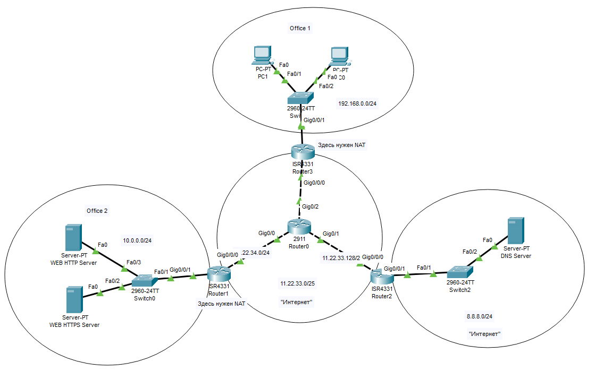

# Урок 8. Основы HTTP/HTTPS и DNS

# Задание: 

Настроить сеть согласно информации на схеме.

— Сымитировать "Интернет" с помощью OSPF. Приватных сетей в маршрутизации быть не должно.
— Для компьютеров из Office 1 предоставить доступ в "Интернет" с помощью PAT.
— Открыть доступ из "Интернета" к серверам из Office 2 c помощью Port Forwarding.
— Для компьютеров из Office 1 должны открываться разные сайты по HTTP и HTTPS из Office 2 по одному доменному имени.

Предоставить скриншоты открытых разных сайтов по одному доменному имени.

Предоставить скриншот таблицы NAT трансляций с Router3. 

Предоставить скриншот таблицы маршрутизации с Router0. 

